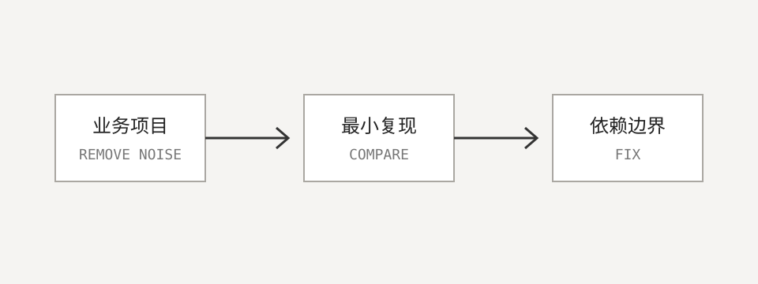

这次问题只在流式响应开启时出现。普通请求一切正常，因此最初很容易把注意力放在网络连接上。

## 先建立最小复现

我移除了业务项目中的缓存、鉴权和日志拦截器，只保留模型客户端以及一条最短的流式调用。问题仍然存在，这说明错误位于框架适配层附近。

继续对比依赖树之后，最终发现两个模块引用了不同版本的响应式库。统一版本并重新运行测试后，流式响应恢复正常。

这次排查再次说明：面对集成问题时，减少变量通常比继续增加日志更有效。
