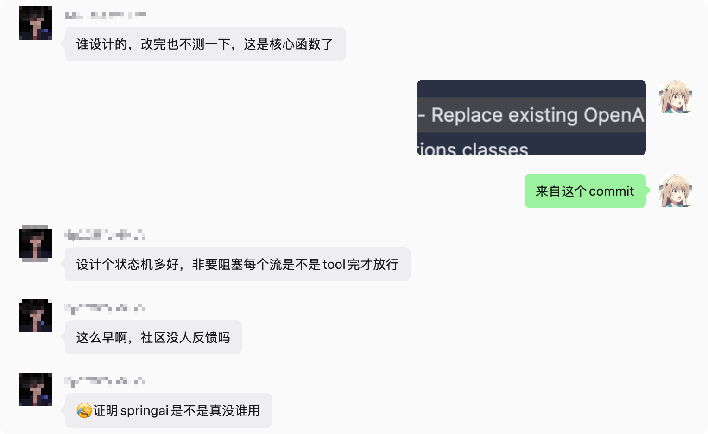

## 问题复现

事情起因于群里一位同学的提问：他用 OpenAI 的模型接入 Spring AI，明明调用的是 `stream()`，结果消息并不流式。

> 在使用 OpenAI 模型接入 Spring AI 时，流式（stream）消息没有逐个 chunk 返回，而是要等所有 chunk 收集完成后，才一次性全部返回。

这个 Bug 还挺离谱的...



复现代码如下：

```java
@RestController
public class ChatController {

    private final ChatClient chatClient;

    public ChatController(ChatClient.Builder chatClientBuilder) {
        this.chatClient = chatClientBuilder.build();
    }

    @GetMapping("/chat")
    public Flux<String> chat(@RequestParam(value = "message") String message) {
        return chatClient
                .prompt()
                .user(message)
                .stream()
                .content()
                .doOnNext(System.out::println);
    }
}
```

```xml
<properties>
    <java.version>21</java.version>
    <spring-ai.version>2.0.0-M7</spring-ai.version>
</properties>
<dependencies>
    <dependency>
        <groupId>org.springframework.boot</groupId>
        <artifactId>spring-boot-starter-webmvc</artifactId>
    </dependency>

    <dependency>
        <groupId>org.springframework.ai</groupId>
        <artifactId>spring-ai-starter-model-openai</artifactId>
    </dependency>
</dependencies>
```

用法非常标准：`ChatClient` 走流式接口，`.stream().content()` 拿到一个 `Flux<String>`，理论上每个 `chunk` 到达时，`doOnNext(System.out::println)` 应该就会打印一次模型输出的内容，例如：

```text
你好
，
很高兴
...
```

但当时的现象是：控制台沉默很久，等模型的 API 整个响应都结束以后，所有 chunk 才一次性全部打印出来。

而在换用 `DeepSeek` 的 `spring-ai-starter-model-deepseek` 后一切正常，恢复真正的流式。那可以猜测，问题出在OpenAI的 `spring-ai-starter-model-openai` 的实现上。

## stream() 的调用链

在定位之前，得先搞清楚一个请求到底是怎么流到 OpenAI 的。Spring AI 2.0 这套 Fluent API（`ChatClient`）并不直接调用模型，它会被一个「Advisor 顾问链」包裹，链路的最末端才是真正发起模型调用的 Advisor。

上面的代码从 `ChatClient` 进入后，调用链大概是这样：

```java
ChatClient.prompt().user(msg).stream().content()      ← Fluent API，返回 Flux<String>
        │
        ▼
DefaultStreamResponseSpec.content()                   ← 只是把 Flux<ChatResponse> 映射成文本
        │
        ▼
advisorChain.nextStream(chatClientRequest)            ← 进入顾问链（Reactive）
        │
        ▼
ChatModelStreamAdvisor.adviseStream(...)              ← 链路末端的「终结 Advisor」
        │   this.chatModel.stream(prompt)  ★ 真正调用模型的唯一入口
        ▼
OpenAiChatModel.stream(Prompt)                        ← StreamingChatModel 接口实现
        │
        ▼
OpenAiChatModel.internalStream(Prompt, prevResponse)  ← 真正订阅 OpenAI SDK 的地方
        │
        ▼
openAiClientAsync.chat().completions().createStreaming(request)
```

在`DefaultChatClient` 构建 `Advisor` 链时，会把真正调用模型的 Advisor 塞到链的最底层（`DefaultChatClient`）：

```java
// At the stack bottom add the model call advisors.
// They play the role of the last advisors in the advisor chain.
this.advisors.add(ChatModelCallAdvisor.builder().chatModel(this.chatModel).build());
this.advisors.add(ChatModelStreamAdvisor.builder().chatModel(this.chatModel).build());
```

而 `content()` 本身并不碰模型，只是做一层文本映射（`DefaultChatClient`）：

```java
@Override
public Flux<String> content() {
    return chatResponse()
            .map(r -> Optional.ofNullable(r.getResult())
                    .map(Generation::getOutput)
                    .map(AbstractMessage::getText)
                    .orElse(""))
            .filter(StringUtils::hasLength);
}
```

真正把请求转交给模型的那一行，在整个 client-chat 模块里只有一处，也就是 `ChatModelStreamAdvisor`，它是 advisor chain 的最后一环，负责真正调用底层模型：

```java
@Override
public Flux<ChatClientResponse> adviseStream(ChatClientRequest chatClientRequest,
        StreamAdvisorChain streamAdvisorChain) {

    return this.chatModel.stream(chatClientRequest.prompt())
        .map(chatResponse -> ChatClientResponse.builder()
            .chatResponse(chatResponse)
            .context(Map.copyOf(chatClientRequest.context()))
            .build())
        .publishOn(Schedulers.boundedElastic());
}
```

`chatModel.stream(Prompt)` 来自 `StreamingChatModel` 这个函数式接口，`OpenAiChatModel` 实现了它：

```java
// OpenAiChatModel.java
@Override
public Flux<ChatResponse> stream(Prompt prompt) {
    Prompt requestPrompt = buildRequestPrompt(prompt);
    verifyPromptChatOptions(requestPrompt);
    return internalStream(requestPrompt, null);   // ← 真正干活的是 internalStream
}
```

到这里就非常明确了：如果 OpenAI 的 streaming 出问题，关键点大概在 `OpenAiChatModel.stream()` 或它调用的 `internalStream()`。

## OpenAiChatModel 如何对接的 OpenAI 流

真正的实现是 `internalStream()`。在最底层，Spring AI 用 OpenAI Java SDK 的异步 streaming API 订阅 chunk，然后把每个 chunk 转成 Spring AI 自己的 `ChatResponse`。下面这段为了方便阅读，省略了一部分 metadata 封装的代码：

```java
Flux<ChatResponse> chatResponses = Flux.<ChatResponse>create(sink -> {
    this.openAiClientAsync.chat().completions().createStreaming(request).subscribe(chunk -> {
        try {
            ChatCompletion chatCompletion = chunkToChatCompletion(chunk);

            List<Generation> generations = chatCompletion.choices().stream()
                    .map(choice -> buildGeneration(choice, metadata, request))
                    .toList();

            sink.next(new ChatResponse(generations, from(chatCompletion, accumulated)));
        }
        catch (Exception e) {
            sink.error(e);
        }
    }).onCompleteFuture().whenComplete((unused, throwable) -> {
        if (throwable != null) {
            sink.error(throwable);
        }
        else {
            sink.complete();
        }
    });
});
```

这一段其实是没问题的，OpenAI SDK 每来一个 `ChatCompletionChunk`，这里就会执行一次 `sink.next(...)`。

## collectList() 破坏了流式

在原本的代码里，`chatResponses` 后面接了这样一段逻辑：

```java
return flux.collectList().flatMapMany(list -> {
    if (list.isEmpty()) {
        return Flux.empty();
    }

    boolean hasToolCalls = list.stream()
        .map(this::safeAssistantMessage)
        .filter(Objects::nonNull)
        .anyMatch(am -> !CollectionUtils.isEmpty(am.getToolCalls()));

    if (!hasToolCalls) {
        if (list.size() > 2) {
            ChatResponse penultimateResponse = list.get(list.size() - 2);
            ChatResponse lastResponse = list.get(list.size() - 1);
            Usage usage = lastResponse.getMetadata().getUsage();
            observationContext.setResponse(new ChatResponse(
                    penultimateResponse.getResults(),
                    from(penultimateResponse.getMetadata(), usage)));
        }
        return Flux.fromIterable(list);
    }

    // tool call 的聚合和执行逻辑
});
```

看到 `collectList()` 我直接一个 `?`。


> 在 Reactor 里，`collectList()` 的语义是：把上游所有元素收集进一个 `List`，等上游 `onComplete` 以后，再向下游发出这个 `List`。

这对普通批处理很方便，但它会天然破坏 streaming。因为早到达的 chunk 也要等最后一个 chunk 到达以后才能继续往下游走。

所以旧实现里的实际执行过程是：

```text
OpenAI chunk 1 -> sink.next(response1) -> 被 collectList 收起来
OpenAI chunk 2 -> sink.next(response2) -> 被 collectList 收起来
OpenAI chunk 3 -> sink.next(response3) -> 被 collectList 收起来
...
OpenAI complete
  -> collectList 发出 List<ChatResponse>
  -> Flux.fromIterable(list)
  -> 下游一次性收到所有 chunk
```

这就解释了为什么业务代码里明明用了 `stream().content()`，最终表现却像阻塞调用。

## 为什么旧代码会这么写

只看 `collectList()` 很容易觉得这个 bug 修起来就是删一行，但真实情况没有那么简单。

因为 OpenAI 的 stream 不只会返回普通文本 chunk，还可能返回 `tool call chunk`、`usage chunk`、`finish reason` 等信息。Spring AI 在模型层不仅要把内容往外发，还要维护完整的 `ChatResponse` 语义。

这里有两个背景知识点。

第一个是 `usage`。OpenAI 的流式响应里，`token usage` 通常不是每个文本 chunk 都带的，而是靠后面的特殊 chunk 才能拿到。旧代码里在 `collectList()` 之前还有一段 `buffer(2, 1)`：

```java
}).buffer(2, 1).map(buffer -> {
    ChatResponse first = buffer.get(0);
    if (request.streamOptions().isPresent() && buffer.size() == 2) {
        ChatResponse second = buffer.get(1);
        if (second != null) {
            Usage usage = second.getMetadata().getUsage();
            if (!UsageCalculator.isEmpty(usage)) {
                return new ChatResponse(first.getResults(), from(first.getMetadata(), usage));
            }
        }
    }
    return first;
});
```

这段代码的意图是把后一个 chunk 里的 usage 补到前一个响应上，避免最终观测数据缺失。这个思路本身不是问题，问题是后面又为了构造最终响应做了 `collectList()`。

第二个是 `tool call`。流式 `tool call` 的参数通常是分多个 chunks 返回的，例如第一个 chunk 是：

```json
{"city"
```

第二个 chunk 才是：

```json
:"Paris"}
```

单独看第一个 chunk，它不是一个完整 JSON，也不能拿去执行工具。所以 `tool call` 场景确实需要聚合：要把分散在多个 chunk 里的 `id`、`name`、`arguments` 合成一个完整的 `AssistantMessage.ToolCall`，然后再决定是否执行工具、是否递归请求模型。

所以修复目标要同时保持两个特性：
- 普通文本 chunk 必须立即发给下游；
- tool call 和最终观测数据仍然要在流结束后聚合，内部 tool execution 的行为不能被破坏。

## Bug的修复思路

我的修复思路是把「流式透传」和「聚合」拆开，具体拆成三条互不干扰的路径：

| 路径            | 需求                               | 做法                                                         |
| --------------- | ---------------------------------- | ------------------------------------------------------------ |
| **1. 流式透传** | 普通内容要逐个 chunk 发            | `filter` 让「非工具调用」的 chunk 立刻放行                   |
| **2. 聚合观测** | 流结束时要有完整响应给 Observation | `doOnNext` 边发边用「旁路 list」收集，`doOnComplete` 时统一聚合 |
| **3. 工具执行** | 工具调用要拼完整后执行             | `concatWith` 在流结束后追加一段，处理合并好的 ToolCall       |

新的代码不再用 `collectList()` 卡住整条流，而是边流式输出，边把响应保存下来，等上游结束后再做聚合：

```java
Flux<ChatResponse> flux = chatResponses
    .contextWrite(ctx -> ctx.put(ObservationThreadLocalAccessor.KEY, observation));

// 旁路容器：边流式输出边收集一份，供结束时聚合用
List<ChatResponse> streamedResponses = Collections.synchronizedList(new ArrayList<>());
AtomicReference<ChatResponse> aggregatedResponse = new AtomicReference<>();

return flux
    .doOnNext(streamedResponses::add)        // 1. 旁路收集（不阻塞主流）
    .filter(this::shouldStreamResponse)      // 2. 普通内容 chunk 立刻放行
    .doOnComplete(() -> {                    // 3. 流结束时：聚合 → Observation
        ChatResponse aggregated = aggregateStreamingResponses(streamedResponses);
        if (aggregated != null) {
            aggregatedResponse.set(aggregated);
            observationContext.setResponse(aggregated);
        }
    })
    .concatWith(Flux.defer(() -> {           // ④ 流结束后追加：处理工具调用
        ChatResponse aggregated = aggregatedResponse.get();
        if (aggregated == null) {
            return Flux.empty();
        }
        return handleStreamingToolExecution(prompt, aggregated);
    }))
    .doOnError(observation::error)
    .doFinally(s -> observation.stop());
```

其中 `shouldStreamResponse` 判断是否有工具调用的内容：

```java
// 工具调用 chunks 不直接发，留给聚合阶段
private boolean shouldStreamResponse(ChatResponse response) {
    return !response.hasToolCalls();
}
```

普通文本响应没有 tool call，直接流出去。tool call 响应先不往外发，因为它可能只是一个一半的函数调用，需要等完整聚合后再处理。

修复后的 `aggregateStreamingResponses()` 把原来塞在 `collectList().flatMapMany(...)` 里的聚合逻辑抽了出来：

```java
private @Nullable ChatResponse aggregateStreamingResponses(List<ChatResponse> responses) {
    if (responses.isEmpty()) {
        return null;
    }

    Map<String, ToolCallBuilder> builders = new HashMap<>();
    StringBuilder text = new StringBuilder();

    // ... 遍历所有 chunk：拼接 text、merge 工具调用碎片、收集 metadata ...
    ChatGenerationMetadata finalGenMetadata = ChatGenerationMetadata.NULL;
    Map<String, Object> props = new HashMap<>();
    ChatResponse lastResponseWithResult = null;

    for (ChatResponse chatResponse : responses) {
        AssistantMessage assistantMessage = safeAssistantMessage(chatResponse);
        if (assistantMessage == null) {
            continue;
        }

        lastResponseWithResult = chatResponse;

        if (assistantMessage.getText() != null) {
            text.append(assistantMessage.getText());
        }
        if (assistantMessage.getMetadata() != null) {
            props.putAll(assistantMessage.getMetadata());
        }
        mergeToolCalls(builders, assistantMessage);

        Generation generation = chatResponse.getResult();
        if (generation != null && generation.getMetadata() != ChatGenerationMetadata.NULL) {
            finalGenMetadata = generation.getMetadata();
        }
    }

    List<AssistantMessage.ToolCall> mergedToolCalls = builders.values()
        .stream()
        .map(ToolCallBuilder::build)
        .filter(toolCall -> StringUtils.hasText(toolCall.name()))
        .toList();

    AssistantMessage.Builder assistantMessageBuilder = AssistantMessage.builder()
        .content(text.toString())
        .properties(props);

    if (!mergedToolCalls.isEmpty()) {
        assistantMessageBuilder.toolCalls(mergedToolCalls);
    }

    ChatResponseMetadata finalMetadata = aggregateStreamingMetadata(responses, lastResponseWithResult);
    return new ChatResponse(List.of(new Generation(assistantMessageBuilder.build(), finalGenMetadata)),
            finalMetadata);
}
```

这段代码做了几件事：

- 把所有文本 chunk 拼成最终文本；
- 合并每个 chunk 里的 message metadata；
- 记录最后一个有效的 generation metadata；
- 把分片的 tool call 合并成完整的 tool call；
- 从最后的响应里提取 usage，并合并到最终 metadata。

也就是说，外部用户不再被聚合阻塞，但 Spring AI 自己仍然能拿到最终完整的 `ChatResponse`。

## Tool Call 为什么要特殊处理

Tool Call 合并最容易踩坑，因为 OpenAI 的 delta 是增量结构。一个工具调用可能分多次返回，每次只给一部分字段。

修复后的逻辑用 `chunkChoice.index()` 和 `deltaToolCall.index()` 作为 key 来定位同一个工具调用：

```java
private void mergeToolCalls(Map<String, ToolCallBuilder> builders, AssistantMessage assistantMessage) {
    if (CollectionUtils.isEmpty(assistantMessage.getToolCalls())) {
        return;
    }

    Object chunkChoiceObject = assistantMessage.getMetadata().get("chunkChoice");
    if (chunkChoiceObject instanceof ChatCompletionChunk.Choice chunkChoice
            && chunkChoice.delta().toolCalls().isPresent()) {
        List<ChatCompletionChunk.Choice.Delta.ToolCall> deltaToolCalls = chunkChoice.delta().toolCalls().get();
        for (int i = 0; i < assistantMessage.getToolCalls().size() && i < deltaToolCalls.size(); i++) {
            AssistantMessage.ToolCall toolCall = assistantMessage.getToolCalls().get(i);
            ChatCompletionChunk.Choice.Delta.ToolCall deltaToolCall = deltaToolCalls.get(i);
            String key = chunkChoice.index() + "-" + deltaToolCall.index();
            builders.computeIfAbsent(key, keyValue -> new ToolCallBuilder()).merge(toolCall);
        }
        return;
    }

    for (AssistantMessage.ToolCall toolCall : assistantMessage.getToolCalls()) {
        builders.computeIfAbsent(toolCall.id(), key -> new ToolCallBuilder()).merge(toolCall);
    }
}
```

这里不能只用 `toolCall.id()`。因为在流式 delta 里，后续分片可能没有 id、没有 name，只带 arguments 的一小段。如果只按 id 合并，后面的空 id 分片可能就和前面的工具调用断开了。

用 choice index + tool call index，才能稳定地把这些分片拼回同一个工具调用。

最后，内部工具执行逻辑也被单独抽出来：

```java
private Flux<ChatResponse> handleStreamingToolExecution(Prompt prompt, ChatResponse aggregated) {
    ChatOptions options = prompt.getOptions();
    Assert.state(options != null, "ChatOptions must not be null");

    // 不需要执行工具：是工具调用就发合并后的那一个、否则什么都不发
    if (!this.toolExecutionEligibilityPredicate.isToolExecutionRequired(options, aggregated)) {
        return aggregated.hasToolCalls() ? Flux.just(aggregated) : Flux.empty();
    }

    // 需要执行工具：执行后用历史重新发起一次 internalStream（递归流式）
    if (this.internalToolExecutionWarned.compareAndSet(false, true)) {
        logger.warn(
            "Internal tool execution in OpenAiChatModel is deprecated since 2.0.0 and will be removed in 3.0.0. "
                + "Use ChatClient with ToolCallAdvisor instead.");
        }

    return Flux.deferContextual(ctx -> {
        ToolExecutionResult toolExecutionResult;
        try {
            ToolCallReactiveContextHolder.setContext(ctx);
            toolExecutionResult = this.toolCallingManager.executeToolCalls(prompt, aggregated);
        }
        finally {
            ToolCallReactiveContextHolder.clearContext();
        }

        if (toolExecutionResult.returnDirect()) {
            return Flux.just(ChatResponse.builder()
                .from(aggregated)
                .generations(ToolExecutionResult.buildGenerations(toolExecutionResult))
                .build());
        }

        return this.internalStream(new Prompt(toolExecutionResult.conversationHistory(), options), aggregated);
    }).subscribeOn(Schedulers.boundedElastic());
}
```

这样普通文本的流式体验和 tool call 的完整语义就都保留了。

## 写在最后

修完以后，再跑最开始的 Controller，`doOnNext` 终于会在 OpenAI chunk 到达时立即触发了，而不是等所有 chunk 收集完成以后才一次性倾泻出来。

这个 Bug 的根源其实很简单：一个 `collectList()` 把流式语义变成了批处理，这也是 Reactor 代码比较容易踩坑的地方，操作符的语义往往和它的名字不完全对应，`collectList()`、`reduce()`、`buffer()` 这些操作都会「攒」数据，稍不注意就把流式变成了阻塞。

最后，虽然这个 [PR](https://github.com/spring-projects/spring-ai/pull/6139) 最终没有被合并（Spring AI 在 2.0.0-RC1 里直接重写了 `stream()` 方法），但从发现问题到解决问题这一路，还是挺有意思的喵。
